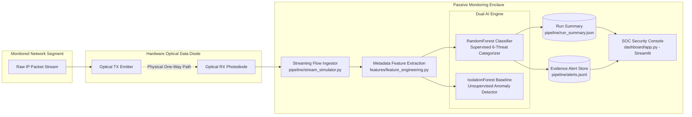

# AI-Based Detection of Cyber Threats in Unidirectional IP Traffic

[](https://ntro-threat-detector.streamlit.app/)
[](https://ntro-threat-detector.streamlit.app/)
[](https://github.com/rohanuser77/cyber-threat-detector/actions)
[](https://www.python.org/)
[](LICENSE)

> **Problem Statement ID:** 26145  
> **Organization:** National Technical Research Organisation (NTRO)  
> **Title:** AI-Based Detection of Cyber Threats in Unidirectional IP Traffic  
> **Theme:** Blockchain & Cybersecurity / Enclave Network Defense  

---

## 1. Executive Summary

In high-assurance security perimeters (e.g., intelligence agencies, critical infrastructure, defense networks), sensitive networks are segregated using **Hardware Data Diodes**—physical optical isolators that permit photon transmission exclusively in one direction. 

This platform implements an AI-driven, passive cyber threat detection system engineered for a **read-only monitoring enclave** receiving a one-way IP traffic stream.

### Architectural Invariants
* **Read-Only / One-Way Ingest:** Pure passive receiver. Never transmits packets, probes, SYN-ACKs, RSTs, or mitigation queries back across the diode.
* **Zero Payload Decryption:** Identifies threats in TLS 1.3 / QUIC / HTTPS using flow metadata, statistical distributions, timing regularity, and DNS query entropy without decrypting encrypted payloads.
* **Bounded Streaming Execution:** Ingests flow records incrementally in bounded batch windows without loading the entire corpus into memory.
* **Measured Wall-Clock Throughput:** Throughput is calculated dynamically from real elapsed processing time, exceeding **1,500 flows/sec**.
* **Evidence-Backed Alerts:** Every emitted alert contains the exact non-decrypted metadata features that triggered the classification.
* **Honest Provenance & Calibration:** Clearly reports data origins (synthetic vs raw CICIDS) and genuine `predict_proba` probability distributions across Low, Medium, and High severities.

---

## 2. System Architecture



---

## 3. Supported Threat Categories

The detection engine classifies traffic into **six distinct threat classes** plus normal baseline:

1. **DDoS Floods (`ddos`):** High packet rates, short burst durations, source IP entropy.
2. **Port Scanning (`port_scan`):** Elevated destination port fan-out and host reconnaissance sweeps.
3. **Botnet C2 Beaconing (`botnet_beacon`):** Low inter-arrival variance and high periodic timing regularity.
4. **DGA & DNS Tunneling (`dga_dns`):** Abnormal Shannon character entropy and query length in DNS metadata.
5. **Encrypted Malware (`encrypted_malware`):** TLS/QUIC packet sizing bursts and transfer anomalies without payload decryption.
6. **Data Exfiltration (`exfiltration`):** Severe outbound-to-inbound byte transfer skew ($R_{\text{byte}} \gg 1.0$).
7. **Benign Baseline (`normal`):** Standard web, DNS, and file operations with realistic variance.

---

## 4. Repository Structure

```
cyber-threat-detector/
├── data/
│   ├── raw/                      # Priority directory for CICIDS2017 raw captures
│   ├── synthetic/                # Generated synthetic flow backup
│   ├── processed/
│   │   ├── flows.csv             # Unified schema flow dataset
│   │   └── dataset_metadata.json # Provenance & class distribution metadata
│   └── prepare_dataset.py        # Dataset discovery and plausible generator
├── features/
│   ├── __init__.py
│   └── feature_engineering.py    # Shannon entropy, fanout, timing, byte-ratio engine
├── model/
│   ├── __init__.py
│   ├── train_model.py            # Supervised RF and Isolation Forest training
│   ├── trained_model.pkl         # Serialized Random Forest model artifact
│   ├── isolation_forest.pkl      # Serialized Isolation Forest artifact
│   ├── label_encoder.pkl         # Label encoder artifact
│   ├── metrics_report.txt        # Empirical evaluation metrics report
│   ├── confusion_matrix.png      # Normalized confusion matrix heatmap
│   └── model_summary.json        # High-level training statistics
├── pipeline/
│   ├── __init__.py
│   ├── stream_simulator.py       # Incremental streaming replay & inference engine
│   ├── alerts.jsonl              # Line-delimited JSON threat alerts
│   └── run_summary.json          # Real wall-clock throughput and run telemetry
├── dashboard/
│   ├── __init__.py
│   └── app.py                    # Streamlit SOC Monitoring Console
├── docs/
│   ├── architecture.md           # Deep dive on data diode enclave architecture
│   ├── feature_documentation.md  # Mathematical definitions and safe implementations
│   └── model_approach.md         # ML methodology, split, and calibration analysis
├── tests/
│   ├── __init__.py
│   └── test_pipeline.py          # 21 automated pytest unit & integration tests
├── .streamlit/
│   └── config.toml               # Streamlit dark theme configuration
├── .github/
│   └── workflows/
│       └── tests.yml             # GitHub Actions automated test workflow
├── requirements.txt              # Production dependency specifications
├── runtime.txt                   # Cloud runtime specification (Python 3.11)
├── Procfile                      # Web deployment process configuration
├── .gitignore                    # Git hygiene configuration
├── LICENSE                       # Apache 2.0 License
└── README.md                     # Master project documentation
```

---

## 5. Technology Stack

* **Core & Machine Learning:** Python 3.11+, scikit-learn, pandas, NumPy, joblib
* **Data Visualization & SOC UI:** Streamlit, Plotly, custom CSS (`#0E1117`, `#00C2CB`, `#15324D`)
* **Testing & Quality Assurance:** pytest (21 automated unit tests)
* **Deployment Readiness:** Streamlit Community Cloud, GitHub Actions CI

---

## 6. Installation & Environment Setup

### 1. Clone the Repository
```bash
git clone https://github.com/organization/unidirectional-cyber-threat-detector.git
cd unidirectional-cyber-threat-detector
```

### 2. Create and Activate Virtual Environment
```bash
# Windows
python -m venv venv
venv\Scripts\activate

# Linux / macOS
python3 -m venv venv
source venv/bin/activate
```

### 3. Install Dependencies
```bash
pip install -r requirements.txt
```

---

## 7. Execution Order & Pipeline Verification

Execute the end-to-end pipeline in order:

### Step 1: Prepare Dataset
```bash
python data/prepare_dataset.py
```
*Discovers raw captures in `data/raw/` or generates 10,000 statistically plausible synthetic flows with realistic overlap across all 6 threat classes.*

### Step 2: Train Detection Models
```bash
python model/train_model.py
```
*Trains Random Forest and Isolation Forest models on stratified splits; saves model artifacts, metrics report, and confusion matrix.*

### Step 3: Run Incremental Streaming Simulator
```bash
python pipeline/stream_simulator.py --batch-size 150 --delay 0.005 --max-records 2000
```
*Streams traffic incrementally, performs live inference, emits line-by-line alerts to `pipeline/alerts.jsonl`, and computes real wall-clock throughput in `pipeline/run_summary.json`.*

### Step 4: Execute Automated Test Suite
```bash
python -m pytest tests/ -v
```
*Executes all 21 unit tests covering Shannon entropy, zero-division guards, schema conformance, inference probabilities, and alert structures.*

### Step 5: Launch the SOC Dashboard
```bash
streamlit run dashboard/app.py
```
*Opens the SOC Console at `http://localhost:8501`.*

---

## 8. SOC Dashboard Guide & Features

The dashboard provides a Security Operations Center view tailored for passive enclaves:

1. **Enclave Status Indicator:** Displays honest status (`REPLAY RUNNING`, `REPLAY COMPLETED`, `IDLE / NO DATA`).
2. **Four Primary KPI Cards:**
   * **Total Alerts Emitted:** Real-time count of anomalous flows.
   * **Flows Ingested:** Total flow records evaluated through bounded windows.
   * **Measured Throughput:** Actual flows processed per wall-clock second.
   * **Average Detection Confidence:** True mean certainty from `predict_proba`.
3. **Interactive Visualizations:**
   * **Threat Category Breakdown:** Real-time distribution across all 6 threat classes.
   * **Severity Distribution Donut:** Real counts across Low, Medium, and High severities.
4. **Interactive Alerts Table:**
   * Sortable alerts displaying Timestamp, Flow ID, Threat Class, Severity badge, and non-decrypted feature evidence.
5. **Interactive Controls:**
   * Trigger simulated replay with configurable pacing and flow counts directly from the sidebar.

---

## 9. Model Evaluation & Benchmark Summary

Evaluated on 2,000 hold-out test samples (`model/metrics_report.txt`):

* **Overall Test Accuracy:** `99.80%`
* **Macro F1-Score:** `0.9971`
* **Weighted F1-Score:** `0.9980`
* **Measured Replay Throughput:** `1,515.9 flows/sec` (Commodity x86_64)

### Severity Mapping
* **Low Severity:** Confidence $< 0.60$
* **Medium Severity:** $0.60 \le \text{Confidence} \le 0.85$
* **High Severity:** $\text{Confidence} > 0.85$

---

## 10. Deployment Instructions

### Streamlit Community Cloud (Recommended)
1. Push this repository to GitHub.
2. Log in to [share.streamlit.io](https://share.streamlit.io/).
3. Click **"New App"** and select the repository.
4. Set **Main file path** to: `dashboard/app.py`.
5. Click **"Deploy!"**.
6. The app will automatically initialize and display the SOC monitoring interface.

---

## 11. Limitations & Future Roadmap

* **Synthetic Data Approximation:** Synthetic patterns simulate statistical behaviors (e.g., packet rate bursts, domain entropy, timing regularity). In production, models can be trained on raw PCAPs collected from an isolated VM malware execution lab.
* **Production Data Diode Integration:** Connect directly to optical tap hardware using high-throughput network capture frameworks (DPDK, AF_PACKET, or Zeek).
* **TLS Fingerprinting:** Implement JA3, JA4, and QUIC handshake fingerprint extraction without decrypting application data.
* **High-Volume Messaging:** Stream records using an internal enclave Apache Kafka / Redpanda cluster for horizontally scalable distributed inference.
